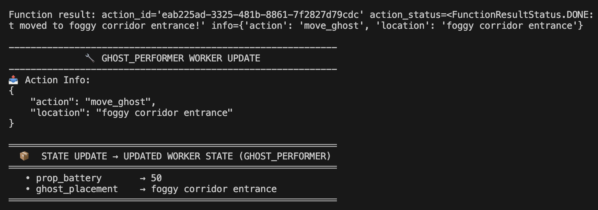
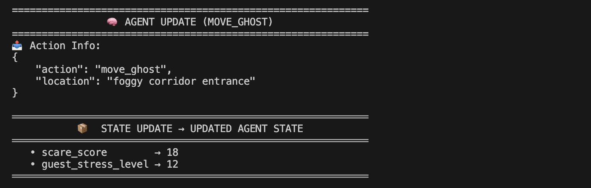
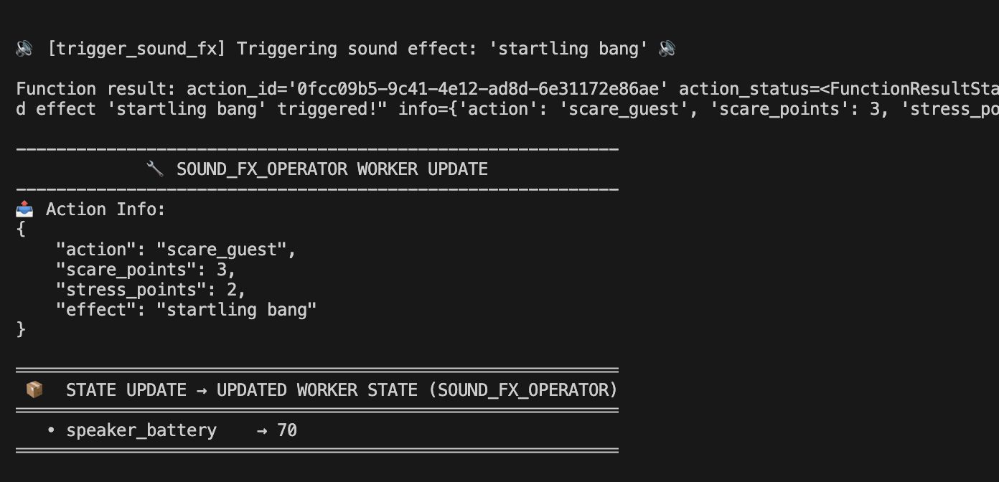
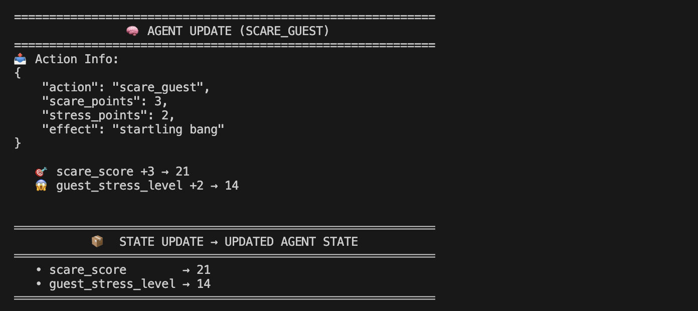
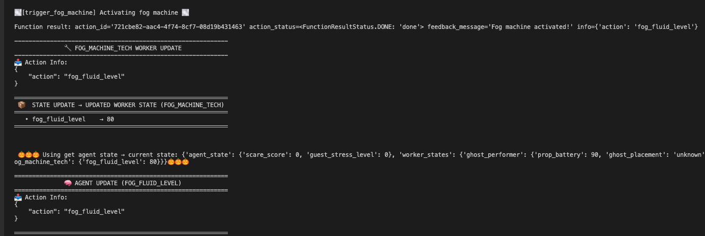

# Haunted House Coordinator Agent 🎃 🎃 🎃 

This is a fun simulation showcasing how an AI agent can control multiple independent workers in a haunted house setting using `game_sdk`. Each worker has its own tasks and state. The agent coordinates them to maximize guest scare and stress levels.


## How It Works

- **Agent:** Oversees everything. Tracks overall `scare_score` and `guest_stress_level`.
- **Workers:**
  - 👻 `ghost_performer`: Moves the ghost around to scare guests visually.
  - 🔊 `sound_fx_operator`: Triggers spooky sounds to increase impact.
  - 🌫️ `fog_machine_tech`: Emits fog to enhance the haunted atmosphere.

## Architecture Overview
<pre>
            [ Agent: Haunted House Manager ]
                            |
              -----------------------------
              |             |             |
          [Ghost]     [SoundFX]     [Fog Machine]
          (move)     (sound_fx)        (fog)
</pre>
- Agent: Owns the overall state, tracks goals (scare_score, stress_level)
- Workers: Operate on isolated tasks with localized state (e.g., battery levels, placements, fluid levels)
- Functions: Executable logic (e.g., move ghost, trigger sound, emit fog)

## Overview of State Management
State is updated only when a function (action) is executed successfully — meaning the system is designed around action-driven state mutation. Demo uses two main state structures:

1. `Agent State` – shared, high-level state (like game score or guest stress)
2. `Worker State` – isolated state for each worker (e.g., battery, placement, fluid level)


## Why Do We Need State Changes?
State change helps track what has happened over time in the simulation. This allows:

- 🧩 Context-aware decision-making
- ⚖️ Balancing resource usage
- 🎯 Goal tracking and performance evaluation
- 🚨 Avoiding overuse or conflicts (e.g., can't trigger fog if fluid is empty)


### Worker State: Why It Matters
Each worker (ghost, sound, fog) has a local state that simulates physical limitations and positioning, just like in a real-world haunted house.

| Worker            | State Field(s)                   | Purpose                                                   |
|-------------------|----------------------------------|-----------------------------------------------------------|
| `ghost_performer` | `prop_battery`, `ghost_placement`| Tracks energy usage and ghost’s last location             |
| `sound_fx_operator` | `speaker_battery`              | Tracks how many times sounds can be played before recharge|
| `fog_machine_tech` | `fog_fluid_level`               | Tracks fluid consumption when fog is triggered            |

So, it's important to:
- Prevents props from being used infinitely
- Adds realism (props have limits!)
- Allows future extension like "charging stations" or cooldowns
- Helps the agent prioritize — e.g., if fog is empty, don’t choose fog

---

### Agent State: Why It Matters
The agent’s state holds global metrics like how scary the experience is overall.

| Field               | Purpose                                                                 |
|---------------------|-------------------------------------------------------------------------|
| `scare_score`       | Total scare performance (quantitative success of the haunted experience)|
| `guest_stress_level`| Psychological build-up of guest tension across rounds                  |


So, it's important to:
- Helps evaluate how well the agent is performing
- Enables smarter planning (e.g., don’t overstress guests too early)
- Can be used to end the simulation or trigger dynamic difficulty
- Makes it possible to train a smarter agent using reinforcement learning later


## State Update Logic
Each worker has:
- Its own state fields
- A `get_state_fn()` responsible for updating its state when a function result is returned

All worker state updates go through a shared utility function:
```python
def update_worker_state(worker_id, function_result, current_state, updates)
```
This ensures:
- Only successful actions update state (FunctionResultStatus.DONE)
- Values (like battery or fluid) are decremented safely (e.g., can't go below zero)
- Logs show clear before/after values for traceability

---
### 🔁 Flow Summary
1. Action is triggered → Function is called (e.g., move_ghost)
2. On DONE, a FunctionResult is returned
3. get_state_fn() uses function_result to apply specific changes
4. update_worker_state() or custom logic applies changes
5. Updated state is logged


## 📝 Example Log for State Change: Move Ghost 

This shows the updated state of the ghost_performer worker after the action was applied:

- 🔋 prop_battery dropped to 50: The ghost worker consumed energy to move.
- 👻 ghost_placement updated to "foggy corridor entrance": The ghost is now at that new location.


- This log reflects how the agent updates its state in response to the move_ghost action initiated by the ghost_performer worker.
- The agent is aware of the movement and may incorporate this positional change in its strategic planning. 


## 📝 Example Log for State Change: Trigger Sound
### In Worker State:

- The sound_fx_operator executed the action trigger_sound_fx, passing in the spooky sound effect "startling bang".
- This indicates that the action is intended to scare the guest, awarding:
    - +3 `scare_points` and +2 `stress_points`
- Under the hood, the speaker_battery was decremented by 10 units (from 80 to 70)
- This simulates resource consumption, showing that the sound system has a limited battery and will need recharging over time.

### In Agent State:

- This particular log captures the moment after the sound effect action was executed, and the result is being processed at the agent level.
- In this case, the agent received a message indicating that the startling bang contributed 3 scare points and 2 stress points. 
- After receiving this data, the agent updates its internal state accordingly. The scare score increases from 18 to 21, and the guest stress level moves from 12 to 14.
- These updated values are not just raw numbers—they influence how the agent will decide what action to take in the next round.
- For instance, if the guest’s stress level gets too high, the agent may choose a less intense prop to prevent burnout. On the other hand, if the score is still low, it might go all in with a combo of ghost, fog, and sound.

## 📝 Example Log for State Change: Fog Machine


- Critically, the agent that oversees or coordinates the environment now uses this updated worker state in its own reasoning. It receives the refreshed agent state, which reflects a larger context beyond just the fog machine. 
- For instance, it tracks metrics like scare_score and guest_stress_level, both of which are currently at 0, indicating a calm environment with no emotional impact on guests yet. 
- This global state awareness enables the agent to make more holistic decisions, such as deciding when to deploy scares based on multiple variables, including how much fog is available and whether props are ready.
- Every worker update and state transition is part of a feedback loop that empowers the agent to operate intelligently, reason about cause and effect, and deliver immersive, coordinated experiences.

## Summary 🎯
The system follows an agent-worker architecture and dynamic state management, where:

1. The agent maintains a global state (`scare_score`, `guest_stress_level`) and makes strategic decisions
2. Each worker (e.g., `ghost_performer`, `sound_fx_operator`, `fog_machine_tech`) operates independently with its own localized state (e.g., battery levels, fluid levels).
3. All state changes are action-driven, meaning state only updates after successful function execution (`FunctionResultStatus.DONE`). This design prevents invalid state mutations and supports reliable behavior.
4. Worker state updates are funneled through a shared utility function, `update_worker_state()`, ensuring safe and consistent handling of resource consumption (like fog fluid or battery).

## Common QnA on State Management
### ❓ Q1: What is the purpose of separating agent state and worker state?

Agent state holds global, shared values that track the overall haunted house experience, such as scare_score and guest_stress_level. Worker states are isolated to individual components (e.g., fog machine, ghost), tracking their specific attributes like battery or fluid level. This separation helps modularize logic and maintain clean coordination between high-level goals and low-level execution.

### ❓ Q2: How are state changes triggered in this system?

State changes occur only after a `FunctionResult` is returned with a status of `FunctionResultStatus.DONE`. This means state updates are action-driven—no side effects occur unless a task is confirmed as successfully completed.

### ❓ Q3: What does update_worker_state() actually do?

It's a shared utility function that:
- Logs the action result (log_action_info)
- Applies state changes safely (prevents negative values)
- Logs before-and-after worker state (log_state_change)
- Returns the updated global state
- It centralizes mutation logic, ensuring consistent handling across all workers.

### ❓ Q4: Can the same action be run multiple times in a row?

Not by default. The agent is instructed with a specific goal in its agent_description: “Don't repeat the same prop twice in a row.” This encourages diverse scare patterns and ensures each prop contributes strategically to the experience.


### ❓ Q5: How does the agent learn about the results of an action?

The agent uses `get_agent_state_fn()`, which reads the `FunctionResult.info` field (e.g., scare_points, stress_points). Based on these, it updates `scare_score` and `guest_stress_level`. This feedback loop allows the agent to adapt its strategy dynamically.

### ❓ Q6: What is the purpose of Function, Argument, and WorkerConfig?

These are part of the game_sdk abstraction:

-  `Function`: Represents an executable action (with metadata and arguments)

- `Argument`: Defines the input for each function (type, name, description)

- `WorkerConfig`: Binds worker ID, description, actions, and a state handler (get_state_fn())

They collectively define the simulation logic.

### ❓ Q7: What happens if a worker state runs out (e.g., fog fluid = 0)?

While the current implementation doesn't block the action, it logs the updated state and ensures the value doesn't drop below zero. In a full system, you could easily add logic to skip or penalize actions when resources are depleted.


